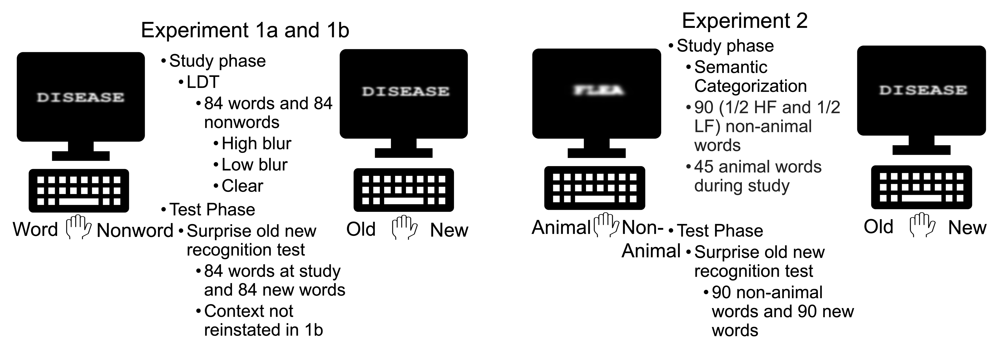
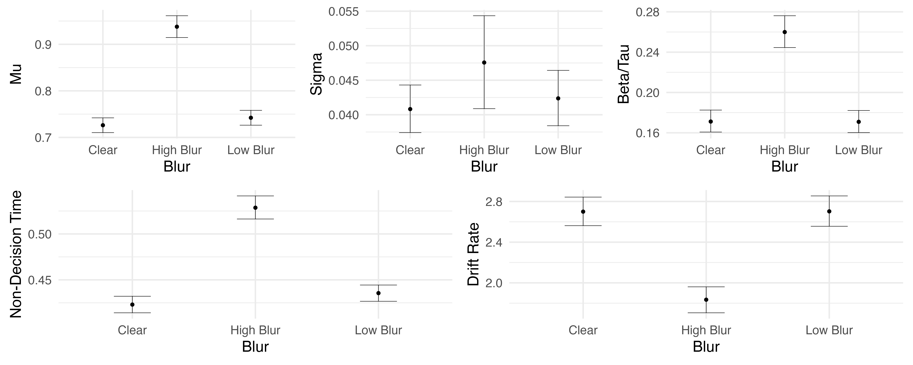
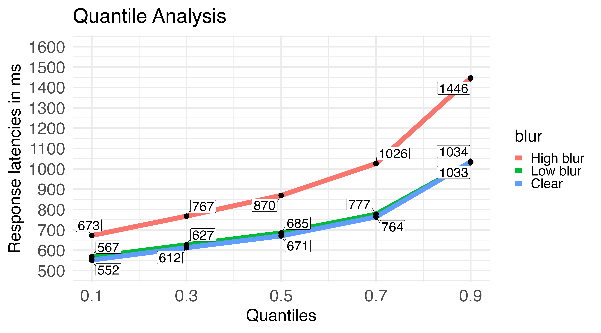
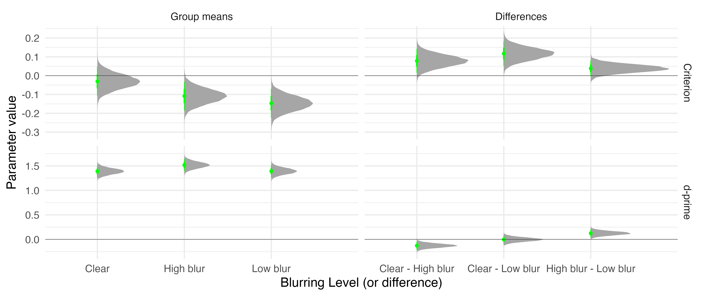

```{r setup, include=FALSE}
knitr::opts_chunk$set(echo = FALSE)

library(tidyverse)
library(knitr)
library(kableExtra)
```

# Introduction

-   Perceptual disfluency like blurring can act as a desirable difficulty [@rosner2015]

    ```{r, out.width='50%', fig.align='center'}
    

    ```

## Theoretical Accounts

```{r}
tibble::tribble(
                   ~Account,                                                                               ~Description,                      ~Loci,
           "Meta-cognitive", "Perceptual disfluency affects meta-cognitive processes via increased system 2 processing",             "Post-lexical",
  "Compensatory-processing",                               "Perceptual disfluency affects the word recognition process",                  "Lexical",
           "Stage-specific",   "Disfluency effects  relies on (1) the stage or level of processing tapped by the task and (2) monitoring and control processes", "Lexical/semantic and Post-lexical"
  ) %>%
  knitr::kable() %>% 
  kable_styling(font_size = 28)


```

### Problem: Traditional methods (e.g., mean RTs) make to hard to investigate underlying mechanisms

# Goals

-   Examine the disfluency effect with differing levels of disfluency

    -   High blur vs. low blur

-   Apply distributional (ex-Gaussian) and computational (diffusion modeling) analyses to study underlying mechanisms of the disfluency effect

# General Methods

```{r}

tibble::tribble(
      ~Experiment,   ~N,
  "Experiment 1a", 216L,
  "Experiment 1b", 216L,
   "Experiment 2", 435L
  ) %>% 
    knitr::kable() %>% 
  kable_styling(font_size = 28)

```

```{r, out.width='80%', fig.align='center'}



```

# Experiment 1a and 1b

> Results from 1b were virtually identical and thus not reported

## RTs

-   Predictions

```{r}
opts <- options(knitr.kable.NA = "")
tibble::tribble(
          ~Account,                ~`Ex-Gaussian`,       ~Diffusion.Model,
   "Metacognitive",  "$\\tau$: incresaed skewing", "decreased drift rate",
    "Compensatory",  "$\\tau$: increased skewing", "decreased drift rate",
                NA,                            NA,                     NA,
                NA, "$\\mu$: increased shifiting",        "increased ndt",
  "Stage-specific",  "$\\tau$: increased skewing", "decreased drift rate",
                NA,                            NA,                     NA,
                NA, "$\\mu$: increased shifiting",        "increased ndt"
  ) %>%
  kable() %>%
  kable_styling(font_size = 28)


```

### Ex-Gaussian and Drift Diffusion

```{r, warning=FALSE, message=FALSE, out.width='100%', fig.align='center'}



```

### Quantile Plots

```{r, warning=FALSE, message=FALSE, out.width='80%', fig.align='center', fig.height=5}



knitr::include_graphics("images/figure_delta.png")


```

-   **High blurred words showed increased skewing** $\tau$ **and shifting** $\mu$**, lower drift, and higher ndt compared to low blurred and clear words**

    -   **Low blurred words only affected the** $\mu$ **and** $ndt$

-   **Results consistent with compensatory and stage-specific accounts**

### Memory

-   Predictions

    -   High blur words will show a disfluency effect

-   Results

```{r, warning=FALSE, message=FALSE, out.width='100%', fig.align='center', fig.height=12}


```

-   **High blur words better remembered than low blurred and clear words**

# Experiment 2

-   The findings from Experiment 1 do not adjudicate between compensatory and stage specific account

-   Here we look at a lexical factor known to interact with perceptual disfluency: Word Frequency

    -   Compensatory processing account predicts better memory for low frequency words

    -   Stage-specific account predicts better memory for high frequency words

### Ex-Gaussian

```{r, warning=FALSE, message=FALSE, out.width='90%', fig.align='center', fig.height=12}

knitr::include_graphics("images/p_gauss_all.png")

```

### Quantile Plots

```{r, warning=FALSE, message=FALSE, out.width='80%', fig.align='center', fig.height=5}

knitr::include_graphics("images/p_q_wf.png")

knitr::include_graphics("images/p_delt_2.png")

```

### Memory

```{r, warning=FALSE, message=FALSE, out.width='100%', fig.align='center', fig.height=10, fig.width=12}

knitr::include_graphics("images/dprime_expt2.png")


```

-   Better memory for low frequency words

-   Better memory for high blurred words

-   High frequency-high blurred words better remembered

# Conclusion

-   All disfluency is not equal

    -   High blurred words showed different distribution pattern than low blur words

        -   High blurred words showed disfluency effect at test
        -   Useful for future replication attempts

-   In Expt 2, memory was better for high frequency-high blurred words

    -   No effect for low frequency words

    -   Lends support for compensatory processing account [@ptok2019]

-   Distributional and computational modeling can be a useful tool to examine conflict encoding effects like perceptual disfluency

# References
